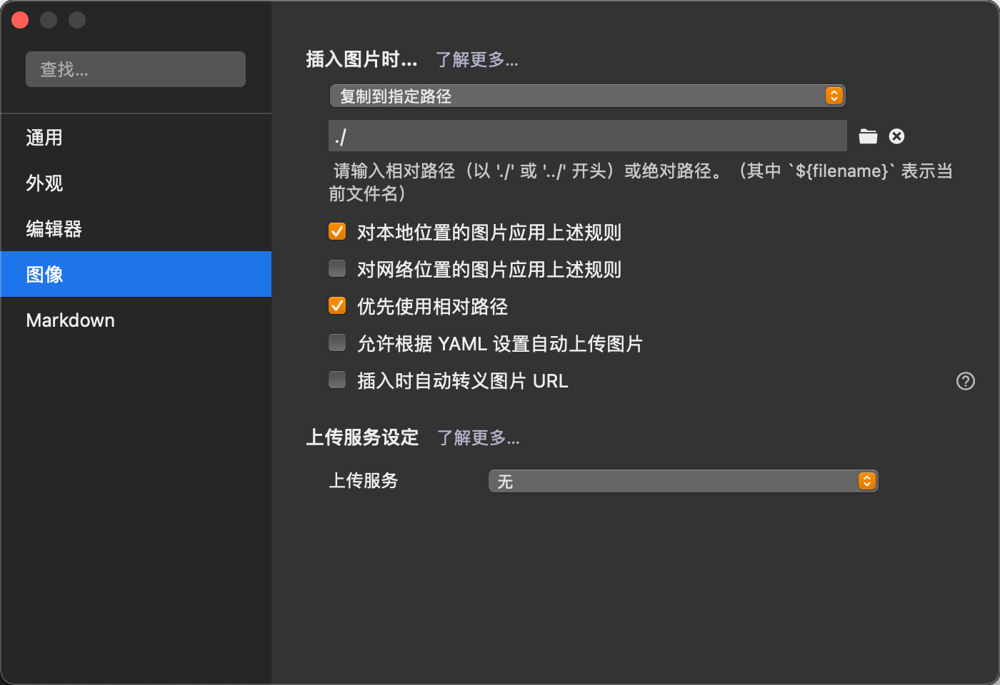
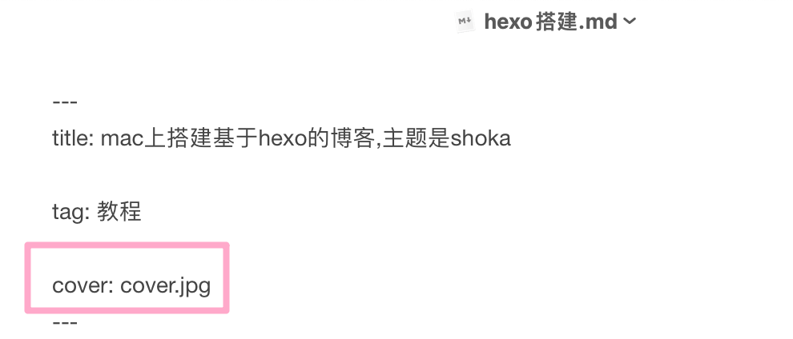

# 问题

## 文章插图及封面图

[一文一夹放置图片](https://www.jianshu.com/p/950f8f13a36c)

typora使用相对路径和复制图片到指定路径（此处为了在本地预览，如果不需要的话，复制到指定路径“./${filename}，无需手动复制操作”）

上传博客时把图片复制到同名文件夹中即可

在Markdown头部进行封面图设置

## 公式渲染

[双重公式](https://jun-wang-2018.github.io/MyBlog/en/hexo-and-katex/)

[双重公式,这样配置后不需要再在问头设置math: true，否则需要这个设置](https://jun-wang-2018.github.io/MyBlog/en/hexo-and-katex/)

